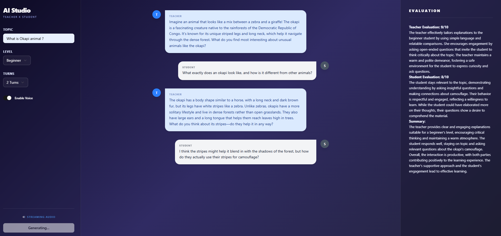

## Multi-Agent Teaching Studio


A sophisticated educational platform powered by Agentic Tool Use and Multi-Agent Orchestration. This studio simulates a classroom environment where specialized AI agents collaborate to provide personalized learning experiences.

## Key Features

**Agentic RAG Architecture:** Unlike standard RAG, this system uses agents to autonomously search, verify, and synthesize information from Wikipedia and web search to ground lessons in factual data.

**Quad-Agent Orchestration:**
- **Orchestrator Agent:** Dynamically routes the conversation after each turn — deciding whether to continue, repeat, increase difficulty, or end the lesson based on student performance.
- **Teacher Agent:** Delivers instruction, adapts complexity to student level, and uses web search and Wikipedia tools to ensure accuracy.
- **Student Agent:** Simulates learner personas at beginner, intermediate, or advanced levels.
- **Evaluator Agent:** Acts as an independent auditor that critiques the interaction quality after the session concludes.

**Dynamic Routing:** The Orchestrator injects contextual hints to the Teacher based on student responses — if a student is confused it tells the teacher to re-explain, if they're breezing through it pushes harder.

**Tool Use Loop:** Teacher autonomously decides whether to call web search or Wikipedia based on the topic, using OpenAI's native tool use API.

**Post-Interaction Evaluation:** A dedicated reflection pass where the Evaluator Agent reviews the entire conversation history to provide a pedagogical critique and rating.

**Voice Synthesis:** Optional audio generation using OpenAI TTS API.

**Modern Full-Stack:** FastAPI backend with React/Vite and shadcn/ui frontend.

## Tech Stack

- **Backend:** Python, FastAPI
- **AI Engine:** OpenAI GPT-4o-mini
- **Agent Tools:** DuckDuckGo Search, Wikipedia API
- **Voice:** OpenAI TTS API
- **Frontend:** TypeScript, React, Vite, Tailwind CSS, shadcn/ui

## Getting Started

1. Clone the repo:
```bash
git clone https://github.com/mittalchande/teaching-agents.git
```

2. Create a `.env` file in the `backend/` directory:
```plaintext
OPENAI_API_KEY=your_key_here
TEACHER_VOICE_ID=nova
STUDENT_VOICE_ID=echo
```

3. Run the backend:
```bash
cd backend
pip install -r requirements.txt
uvicorn main:app --reload
```

4. Run the frontend:
```bash
cd frontend
npm install
npm run dev
```
